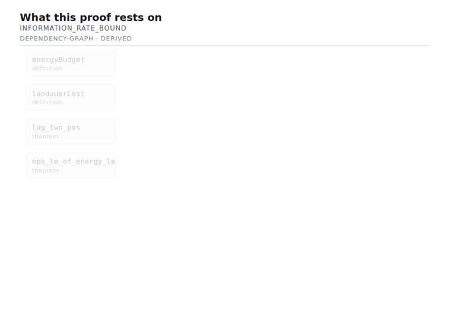
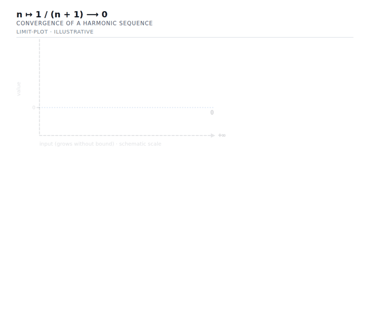
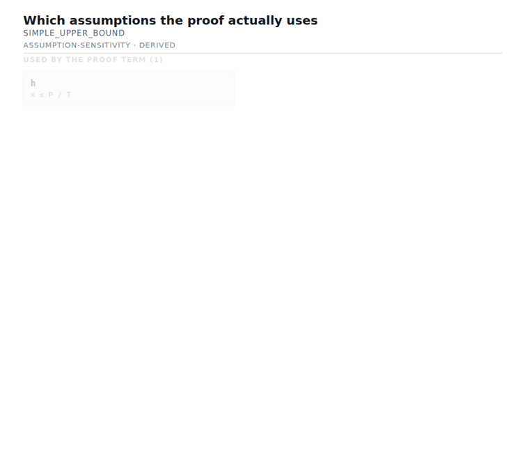

# ProofLens

**Visual interpretability for formal mathematics.**

ProofLens transforms machine-verified mathematics into structured explanations
and visual representations.

Lean can tell us that a theorem follows from its formal assumptions. ProofLens
helps humans see what that theorem is saying.

```text
machine-verifiable mathematics
            ↓
        ProofLens
            ↓
human mathematical understanding
```

<p align="center">
  
  <br/>
  <em>A real proof building itself in its own dependency order — the Landauer
  information-rate bound, extracted from Lean, animated by
  <code>prooflens render --animate</code>. The order is derived from the proof
  term; only the pacing is a display choice.</em>
</p>

---

## Why this exists

Formal systems are becoming capable of representing increasingly complicated
theories and proofs. Future automated reasoning systems will produce formally
verified mathematical structures whose implications are difficult for humans to
understand directly — results that are certainly true and not obviously
meaningful.

ProofLens is interpretability infrastructure for that situation. It sits between
a proof assistant and a person, and its entire discipline is keeping two things
apart:

- what was **proved**, and
- what we **think it means**.

Formal verification remains the standard of truth. ProofLens never adjudicates
mathematics; it only helps read it.

## What v0.1 does

Point it at a Lean 4 declaration and it will show you, in the infoview next to
your code:

- the exact formal statement, as Lean printed it;
- a mathematical rendering of the conclusion (`N / t ≤ P · D / (kB · T · log 2)`);
- what kind of statement it is — an upper bound, a monotonicity property, a sign
  fact, a definition, an equivalence;
- **which of the stated hypotheses the proof actually uses**;
- how the bound responds to each parameter, where that follows from the
  hypotheses;
- a generated figure — optionally **animated**: dependency graphs build
  foundations-first to the conclusion in the proof's own dependency order,
  limit curves trace onto their asymptote (`prooflens render --animate`);

   

- what the proof rests on: its local dependency graph, its axioms, and whether
  it reaches `sorry`;
- and, for every one of the above, why ProofLens is telling you it.

Here is a real example, from ProofLens's own corpus:

```text
$ prooflens explain examples/corpus.formal-ir.json information_rate_bound

WHAT WAS PROVED  [verified]
  ∀ (P T kB D N t : ℝ), 0 < P → 0 < T → 0 < kB → 0 < D → 0 < t →
    N * (kB * T * Real.log 2 / D) ≤ P * t → N / t ≤ P * D / (kB * T * Real.log 2)

WHAT KIND OF STATEMENT THIS IS  [derived]
  The theorem establishes an upper bound: `N / t` cannot exceed
  `P · D / (kB · T · log(2))` under the stated assumptions.

WHICH ASSUMPTIONS DID THE WORK  [derived]
  `hP : 0 < P` is stated but never used by this proof term. That does not mean
  the hypothesis is mathematically unnecessary — only that this particular
  proof does not touch it.

HOW THE UPPER BOUND RESPONDS  [derived]
  The upper bound is `P · D / (kB · T · log(2))`. Holding the other quantities
  fixed, and using only the sign hypotheses this theorem states: increasing `P`
  increases it; increasing `T` decreases it; increasing `kB` decreases it;
  increasing `D` increases it.

WHAT THE SYMBOLS MEAN  [interpreted]
  `P` is electrical power drawn by the machine (W); `T` is operating temperature
  of the heat bath (K) … These readings come from the declaration's ProofLens
  annotations, not from anything Lean checked.
```

Note the tag on every line. That is the point of the project, not a decoration —
see [the epistemic model](docs/epistemic-model.md).

Nobody told ProofLens to look for a redundant hypothesis in that theorem. It
found `hP` by walking the elaborated proof term.

## The tags

Every piece of information ProofLens produces carries one of six statuses:

|                |                                                                       |
| -------------- | --------------------------------------------------------------------- |
| `verified`     | Asserted by the Lean kernel.                                          |
| `derived`      | Computed from verified data by a deterministic, inspectable rule.     |
| `interpreted`  | A reading of the statement, or a human author's declaration about it. |
| `heuristic`    | A rule of thumb, expected to be wrong sometimes.                      |
| `illustrative` | A display choice. It makes no mathematical claim.                     |
| `speculative`  | Produced by a language model. Nothing underwrites it.                 |

Two properties are enforced in code rather than by convention:

1. **`verified` cannot be manufactured.** It requires a kernel witness that only
   the Formal IR loader can mint, and only for a declaration whose proof does not
   reach `sorry`.
2. **Confidence only ever decreases.** Every transformation combines its inputs
   with a weakest-wins fold, so nothing travels back uphill.

When AI-generated interpretation eventually arrives, it arrives labelled, and it
cannot be promoted.

## Getting started

Requirements: [elan](https://github.com/leanprover/elan) (Lean 4.24.0), Node 22,
pnpm 10.

```bash
git clone https://github.com/jdhart81/prooflens
cd prooflens
pnpm install
pnpm build

# Build the extractor (Lean core only — no mathlib needed)
cd lean && lake build && cd ..

# Build the example corpus (this one does use mathlib)
cd corpus && lake exe cache get && lake build && cd ..
```

### In the Lean infoview

This is the primary surface.

```lean
import ProofLens.Widget
import ProofLensExamples.IntelligenceBound

#prooflens ProofLens.Examples.information_rate_bound
```

Put your cursor on the command and the analysis appears in the infoview panel:
figures, layered explanation, provenance, and every intermediate representation.

### From the command line

```bash
# Extract Formal IR from any Lake project
pnpm prooflens extract --project corpus \
  --module ProofLensExamples.IntelligenceBound \
  --out formal-ir.json

pnpm prooflens summary  formal-ir.json
pnpm prooflens explain  formal-ir.json information_rate_bound
pnpm prooflens render   formal-ir.json --out-dir figures --format both
pnpm prooflens coverage formal-ir.json
pnpm prooflens inspect  formal-ir.json information_rate_bound --stage math
```

### In the browser

```bash
pnpm dev:web
```

## How it works

ProofLens does not send Lean source to a model and get a picture back. It builds
intermediate representations, and they are the point:

```text
Lean 4
  ↓   deterministic extraction over Lean.Environment
Formal IR      preserves; interprets nothing
  ↓
MathIR         proof-assistant plumbing becomes mathematics
  ↓
classification + sign analysis + explanation
  ↓
VisualIR       what to show, never how to draw it
  ↓
SVG · Lean infoview widget · text
```

Renderers consume VisualIR and nothing else, which is why the same analysis
drives an editor panel, a terminal, and a web page with no second
implementation. The core requires no language model and no proprietary API.

Every stage is inspectable, from the CLI and from the UI. If ProofLens shows you
something, you can ask it which rule fired and which subterm of which
declaration made it fire.

## When ProofLens does not understand something

It says so, and shows you the theorem anyway:

```text
No deterministic visualization classifier currently supports this theorem
structure. `Filter.Tendsto` is not in ProofLens's constant table yet.
```

The formal statement, its structure, its hypotheses and its dependencies are all
still displayed. Discarding mathematics because it cannot be drawn is the one
outcome ProofLens is not permitted to have — and these cases are the roadmap.
If you hit one, [please report it](.github/ISSUE_TEMPLATE/unsupported_mathematics.md).

## Status

v0.1. It works end to end, and it has been measured.

Against a **679-declaration slice of real mathlib** — order theory, real
analysis, inequalities, binary entropy — ProofLens structurally classifies
**96.2%** of declarations and reads **81.3%** of them end to end, meaning the
conclusion classified _and_ every term inside it has a name. 1,490 figures
render without a failure.

Those numbers started at 76.0% and 33.9%. They moved because ProofLens measures
itself: `prooflens coverage` emits a ranked backlog of exactly which Lean
constants and statement shapes are costing coverage, and two rounds of work
against that backlog produced the difference. Nothing was guessed at. The full
report, including what remains, is in [docs/coverage.md](docs/coverage.md).

```bash
pnpm prooflens coverage formal-ir.json
```

One calibration result is worth stating plainly: assumption sensitivity analysed
437 mathlib declarations and found **zero** stated-but-unused hypotheses. Not
one. That is not a bug — all 770 hypothesis binders in the slice occur in their
proof term, later binder types, or conclusion. Mathlib is curated and linted, and
a redundant hypothesis has to survive both machinery and review to reach it. The tool's value is for drafts, reformalizations, and above all
machine-generated proofs, where redundant hypotheses accumulate because nothing
is grooming them. ProofLens's own hand-written corpus has two.

Remaining limits: only the final proof term is analysed, not tactic structure;
plots are schematic rather than numeric, and they say so; coverage is untested
outside order theory and analysis; dependency graphs are single-module. 1,116
tests. See [the roadmap](docs/roadmap.md).

## Documentation

- [Architecture](docs/architecture.md) — stages, packages, and what each is forbidden to do
- [The epistemic model](docs/epistemic-model.md) — start here
- [MathIR](docs/math-ir.md) — the semantic representation, and how to teach it a new constant
- [VisualIR](docs/visual-ir.md) — the visualization representation, and how to add a renderer
- [Semantic scenes](docs/semantic-scenes.md) — numeric, interactive explanations of what supported theorems represent
- [Coverage against mathlib](docs/coverage.md) — the measured numbers and the ranked backlog
- [Roadmap](docs/roadmap.md)
- ADR [0001](docs/adr/0001-lean-extraction.md) — how extraction works, and why we do not build a tracer
- ADR [0002](docs/adr/0002-first-rendering-surface.md) — why the infoview came first
- ADR [0003](docs/adr/0003-semantic-annotations.md) — why annotations live in docstrings

## Prior art

ProofLens is built alongside, not against, the existing Lean ecosystem.
[LeanDojo](https://github.com/lean-dojo/LeanDojo) is the right tool for repository-scale
tracing and premise extraction, and ProofLens will consume it rather than
reimplement it. [doc-gen4](https://github.com/leanprover/doc-gen4) is the reference
for reading Lean's environment.
[ProofWidgets4](https://github.com/leanprover-community/ProofWidgets4) is the toolkit
for richer infoview interaction, and is where ProofLens will go when it needs
round-trips to Lean.

## Contributing

See [CONTRIBUTING.md](CONTRIBUTING.md). The short version: new information needs
a correct epistemic tag, new classifiers need a stable rule id and a test, and
`verified` may only originate from Lean.

## License

Apache-2.0. See [LICENSE](LICENSE).
