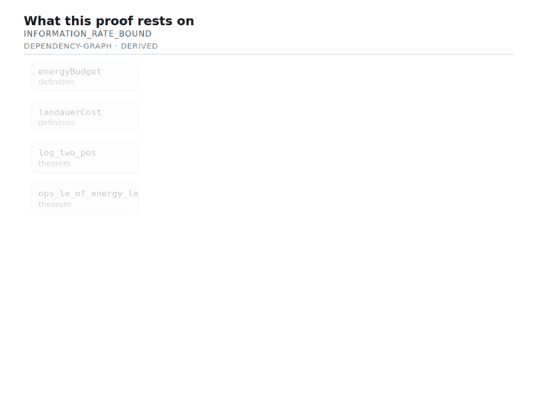
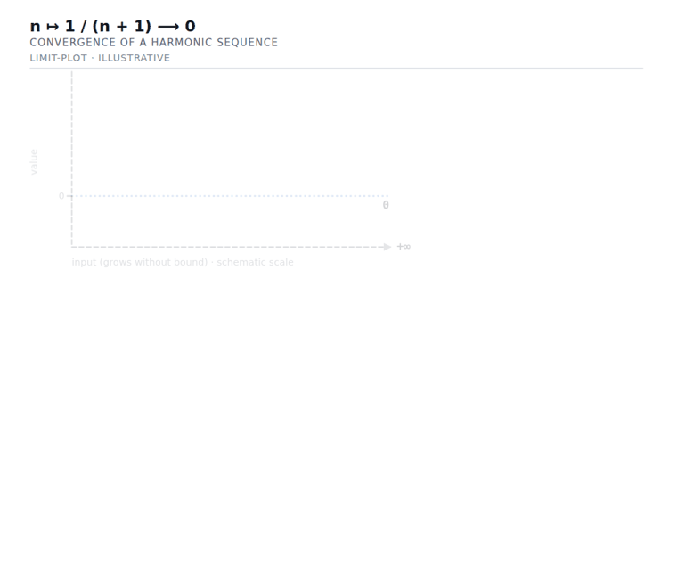
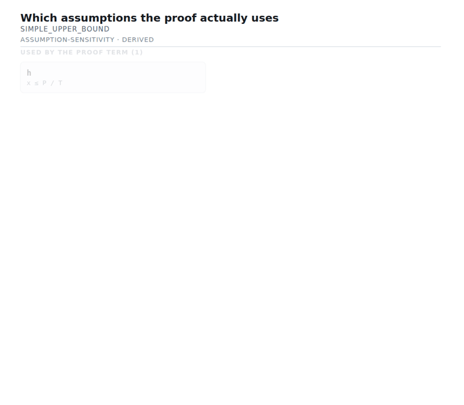

# ProofLens

**See what a Lean statement means—before getting lost in the proof.**

ProofLens turns Lean conjectures and theorems into visual, inspectable
explanations. It shows the objects, relationships, assumptions, proof status and
provenance without pretending that a numerical preview is a proof.

## Get one useful result in two minutes

**[Open ProofLens in your browser](https://jdhart81.github.io/prooflens/)** — no
install or account required. Load a built-in example, change one input, and see
which assumptions and relationships control the result. To paste a supported
declaration, open **Explore your own Lean** and choose **Visualize statement**.

[Follow the exact two-minute walkthrough](docs/two-minute-demo.md) ·
[Try one theorem locally](docs/quickstart.md) ·
[Connect the local MCP preview](docs/mcp.md)

If ProofLens answered a real question—or blocked you before it could—please
[share a short first-use report](https://github.com/jdhart81/prooflens/issues/new?template=builder_trial.yml).
Those reports decide what gets fixed next. If you want to follow the project,
star the repository so the next release is easy to find.

Lean records the formal claim and checks completed proofs. ProofLens helps humans
understand what the claim means, including while its proof is still incomplete.

```text
Lean conjecture or theorem
            ↓
visual explanation + exploration
            ↓
human mathematical understanding
```

<p align="center">
  
  <br/>
  <em>A real proof building itself in its own dependency order — the Landauer
  information-rate bound, extracted from Lean, animated by
  <code>prooflens render --animate</code>. The order is derived from the proof
  term; only the pacing is a display choice.</em>
</p>

---

## Why this exists

A formal statement can be precise and still be difficult to understand. ProofLens
helps a reader see the objects involved, the relationship being asserted, and the
role of the assumptions. Supported interactive scenes let the reader change inputs
and follow their effects through the equation and picture.

Conjectures belong here too. An incomplete proof does not prevent a useful visual
description of its statement. ProofLens labels it unproved: exploring examples
does not establish that the general claim is true.

Visual understanding is the primary experience. Proof status and provenance keep
that explanation honest; specialized certificate tools are secondary workflows.
See the [product direction](docs/product-direction.md) for the user journey,
current limits, and how we measure comprehension.

## Bring your own statement

The browser accepts pasted Lean declarations, `.lean` files, and extracted Formal IR JSON.
For supported real arithmetic it shows interactive curves, values on both sides of the
relationship, assumption checks, and downloadable explanations and SVG charts. It also
recognizes square-root scaling and positive one-sided inverse-square divergence.

Source previews do not run Lean or verify proofs. Imported extraction metadata is not a
verification attestation. Unsupported syntax and mathematical forms remain explicit gaps.
Start with the [own-statement walkthrough](docs/quickstart.md#explore-a-conjecture).

## What v0.1 does

Point it at a Lean 4 declaration and it will show you, in the infoview next to
your code:

- the exact formal statement, as Lean printed it;
- a mathematical rendering of the conclusion (`N / t ≤ P · D / (kB · T · log 2)`);
- what kind of statement it is — an upper bound, a monotonicity property, a sign
  fact, a definition, an equivalence;
- **which of the stated hypotheses the proof actually uses**;
- how the bound responds to each parameter, where that follows from the
  hypotheses;
- a generated figure — optionally **animated**: dependency graphs build
  foundations-first to the conclusion in the proof's own dependency order,
  limit curves trace onto their asymptote (`prooflens render --animate`);

   

- what the proof rests on: its local dependency graph, its axioms, and whether
  it reaches `sorry`;
- an optional, source-pinned [TorchLean adapter](docs/torchlean-adapter.md) that explains neural
  robustness margins and carries an exact-real kernel certificate for its two displayed examples;
- a versioned [research-paper packet importer](docs/paper-packets.md) that binds certificate-required
  claims to exact, hash-matched Formal IR and emits a downloadable READY/HOLD decision;
- and, for every one of the above, why ProofLens is telling you it.

Here is a real example, from ProofLens's own corpus:

```text
$ prooflens explain examples/corpus.formal-ir.json information_rate_bound

WHAT WAS PROVED  [verified]
  ∀ (P T kB D N t : ℝ), 0 < P → 0 < T → 0 < kB → 0 < D → 0 < t →
    N * (kB * T * Real.log 2 / D) ≤ P * t → N / t ≤ P * D / (kB * T * Real.log 2)

WHAT KIND OF STATEMENT THIS IS  [derived]
  The theorem establishes an upper bound: `N / t` cannot exceed
  `P · D / (kB · T · log(2))` under the stated assumptions.

WHICH ASSUMPTIONS DID THE WORK  [derived]
  `hP : 0 < P` is stated but never used by this proof term. That does not mean
  the hypothesis is mathematically unnecessary — only that this particular
  proof does not touch it.

HOW THE UPPER BOUND RESPONDS  [derived]
  The upper bound is `P · D / (kB · T · log(2))`. Holding the other quantities
  fixed, and using only the sign hypotheses this theorem states: increasing `P`
  increases it; increasing `T` decreases it; increasing `kB` decreases it;
  increasing `D` increases it.

WHAT THE SYMBOLS MEAN  [interpreted]
  `P` is electrical power drawn by the machine (W); `T` is operating temperature
  of the heat bath (K) … These readings come from the declaration's ProofLens
  annotations, not from anything Lean checked.
```

The tag on every line distinguishes the mathematical statement from its explanation.
See [the epistemic model](docs/epistemic-model.md).

Nobody told ProofLens to look for a redundant hypothesis in that theorem. It
found `hP` by walking the elaborated proof term.

## The tags

Every piece of information ProofLens produces carries one of six statuses:

|                |                                                                       |
| -------------- | --------------------------------------------------------------------- |
| `verified`     | Asserted by the Lean kernel.                                          |
| `derived`      | Computed from verified data by a deterministic, inspectable rule.     |
| `interpreted`  | A reading of the statement, or a human author's declaration about it. |
| `heuristic`    | A rule of thumb, expected to be wrong sometimes.                      |
| `illustrative` | A display choice. It makes no mathematical claim.                     |
| `speculative`  | Produced by a language model. Nothing underwrites it.                 |

Two properties are enforced in code rather than by convention:

1. **`verified` cannot be manufactured.** It requires a kernel witness that only
   the Formal IR loader can mint, and only for a declaration whose proof does not
   reach `sorry`.
2. **Confidence only ever decreases.** Every transformation combines its inputs
   with a weakest-wins fold, so nothing travels back uphill.

When AI-generated interpretation eventually arrives, it arrives labelled, and it
cannot be promoted.

## Getting started

Requirements: [elan](https://github.com/leanprover/elan) (Lean 4.24.0), Node 22,
pnpm 10.

Want the smallest useful example first? Follow [**one theorem in five minutes**](docs/quickstart.md)
to produce a layered explanation and animated SVG from the checked-in Formal IR without installing
Lean.

```bash
git clone https://github.com/jdhart81/prooflens
cd prooflens
pnpm install
pnpm build

# Build the extractor (Lean core only — no mathlib needed)
cd lean && lake build && cd ..

# Build the example corpus (this one does use mathlib)
cd corpus && lake exe cache get && lake build && cd ..
```

### In the Lean infoview

This is the primary surface.

```lean
import ProofLens.Widget
import ProofLensExamples.IntelligenceBound

#prooflens ProofLens.Examples.information_rate_bound
```

Put your cursor on the command and the analysis appears in the infoview panel:
figures, layered explanation, provenance, and every intermediate representation.

### From the command line

```bash
# Extract Formal IR from any Lake project
pnpm prooflens extract --project corpus \
  --module ProofLensExamples.IntelligenceBound \
  --out formal-ir.json

pnpm prooflens summary  formal-ir.json
pnpm prooflens explain  formal-ir.json information_rate_bound
pnpm prooflens render   formal-ir.json --out-dir figures --format both
pnpm prooflens coverage formal-ir.json
pnpm prooflens inspect  formal-ir.json information_rate_bound --stage math
```

### In the browser

```bash
pnpm dev:web
```

For a quick overview, watch the
[45-second ProofLens community tour](docs/media/prooflens-community-tour.mp4), then open the
[live application](https://jdhart81.github.io/prooflens/).

## How it works

ProofLens does not send Lean source to a model and get a picture back. It builds
intermediate representations, and they are the point:

```text
Lean 4
  ↓   deterministic extraction over Lean.Environment
Formal IR      preserves; interprets nothing
  ↓
MathIR         proof-assistant plumbing becomes mathematics
  ↓
classification + sign analysis + explanation
  ↓
VisualIR       what to show, never how to draw it
  ↓
SVG · Lean infoview widget · text
```

Renderers consume VisualIR and nothing else, which is why the same analysis
drives an editor panel, a terminal, and a web page with no second
implementation. The core requires no language model and no proprietary API.

Every stage is inspectable, from the CLI and from the UI. If ProofLens shows you
something, you can ask it which rule fired and which subterm of which
declaration made it fire.

## When ProofLens does not understand something

It says so, and shows you the theorem anyway:

```text
No deterministic visualization classifier currently supports this theorem
structure. `Filter.Tendsto` is not in ProofLens's constant table yet.
```

The formal statement, its structure, its hypotheses and its dependencies are all
still displayed. Discarding mathematics because it cannot be drawn is the one
outcome ProofLens is not permitted to have — and these cases are the roadmap.
If you hit one, [please report it](.github/ISSUE_TEMPLATE/unsupported_mathematics.md).

## Status

v0.1. It works end to end, and it has been measured.

Against a **679-declaration slice of real mathlib** — order theory, real
analysis, inequalities, binary entropy — ProofLens structurally classifies
**96.2%** of declarations and reads **81.3%** of them end to end, meaning the
conclusion classified _and_ every term inside it has a name. 1,490 figures
render without a failure.

Those numbers started at 76.0% and 33.9%. They moved because ProofLens measures
itself: `prooflens coverage` emits a ranked backlog of exactly which Lean
constants and statement shapes are costing coverage, and two rounds of work
against that backlog produced the difference. Nothing was guessed at. The full
report, including what remains, is in [docs/coverage.md](docs/coverage.md).

```bash
pnpm prooflens coverage formal-ir.json
```

One calibration result is worth stating plainly: assumption sensitivity analysed
437 mathlib declarations and found **zero** stated-but-unused hypotheses. Not
one. That is not a bug — all 770 hypothesis binders in the slice occur in their
proof term, later binder types, or conclusion. Mathlib is curated and linted, and
a redundant hypothesis has to survive both machinery and review to reach it. The tool's value is for drafts, reformalizations, and above all
machine-generated proofs, where redundant hypotheses accumulate because nothing
is grooming them. ProofLens's own hand-written corpus has two.

Remaining limits: only the final proof term is analysed, not tactic structure;
most plots are schematic, while [semantic scenes](docs/semantic-scenes.md) support
a narrow subset of numeric bounds. The browser explores bundled examples and supported pasted Lean statements; use
the editor or CLI to extract declarations from your own Lean project. Coverage is untested outside order
theory and analysis; dependency graphs are single-module. Structural coverage
does not measure reader comprehension. See [the roadmap](docs/roadmap.md).

## Documentation

- [Product direction](docs/product-direction.md) — Lean code to visual mathematical understanding

- [One theorem in five minutes](docs/quickstart.md) — the smallest complete Lean-to-visual path
- [Architecture](docs/architecture.md) — stages, packages, and what each is forbidden to do
- [The epistemic model](docs/epistemic-model.md) — start here
- [MathIR](docs/math-ir.md) — the semantic representation, and how to teach it a new constant
- [VisualIR](docs/visual-ir.md) — the visualization representation, and how to add a renderer
- [Semantic scenes](docs/semantic-scenes.md) — numeric, interactive explanations of what supported theorems represent
- [Research-paper packets](docs/paper-packets.md) — claim inventories, witness matching, and downloadable gate decisions
- [Coverage against mathlib](docs/coverage.md) — the measured numbers and the ranked backlog
- [Roadmap](docs/roadmap.md)
- ADR [0001](docs/adr/0001-lean-extraction.md) — how extraction works, and why we do not build a tracer
- ADR [0002](docs/adr/0002-first-rendering-surface.md) — why the infoview came first
- ADR [0003](docs/adr/0003-semantic-annotations.md) — why annotations live in docstrings

## Prior art

ProofLens is built alongside, not against, the existing Lean ecosystem.
[LeanDojo](https://github.com/lean-dojo/LeanDojo) is the right tool for repository-scale
tracing and premise extraction, and ProofLens will consume it rather than
reimplement it. [doc-gen4](https://github.com/leanprover/doc-gen4) is the reference
for reading Lean's environment.
[ProofWidgets4](https://github.com/leanprover-community/ProofWidgets4) is the toolkit
for richer infoview interaction, and is where ProofLens will go when it needs
round-trips to Lean.

## Contributing

See [CONTRIBUTING.md](CONTRIBUTING.md). The short version: new information needs
a correct epistemic tag, new classifiers need a stable rule id and a test, and
`verified` may only originate from Lean.

Three bounded contribution paths are ready:

- [visualize `Function.Injective`](https://github.com/jdhart81/prooflens/issues/1) — labelled
  `good first issue`;
- [certify all 360 pinned TorchLean examples](https://github.com/jdhart81/prooflens/issues/2);
- [prove generic `reshape` and `concat` enclosure](https://github.com/jdhart81/prooflens/issues/3).

## License

Apache-2.0. See [LICENSE](LICENSE).
