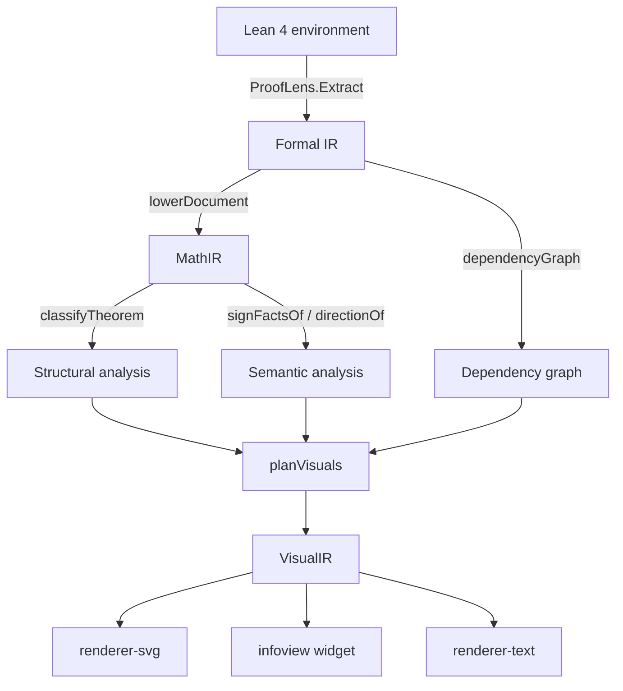
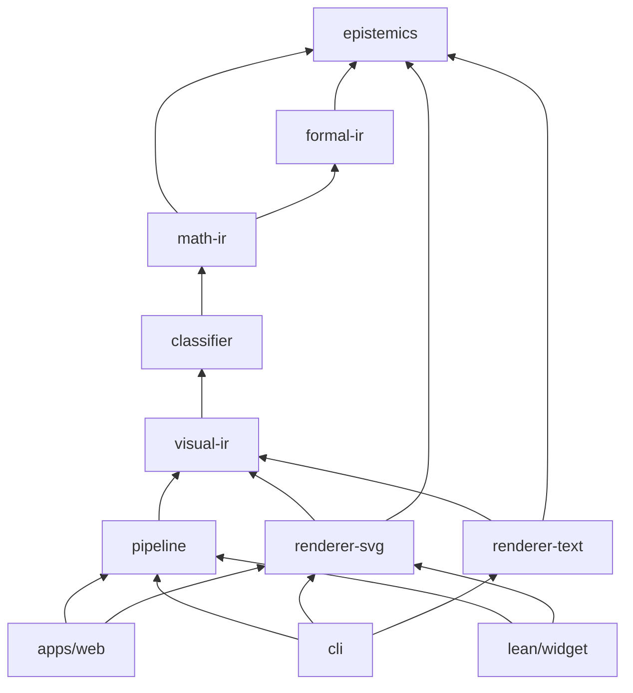

# ProofLens architecture

## Thesis

Lean determines what has been proved. ProofLens helps a human understand what that proof is
saying. These are two different jobs, and the entire architecture exists to keep them from
being confused: the Lean kernel's verdict enters the system exactly once, at extraction, and
is carried forward as a typed `Claim` whose status can only ever weaken as it moves
downstream. Everything ProofLens adds after that point (a reading of a constant, a choice of
axis, a decision about which figure to draw) is labelled as an addition, not as part of the
theorem. A tool that blurs that boundary is worse than no tool at all, because the reader
loses the ability to tell which parts of what they are looking at a machine actually checked.

The mechanism is described in [epistemic-model.md](./epistemic-model.md). This document
describes the stages, the packages, and the boundaries between them.

## The stage pipeline

```
  Lean 4 environment
        │
        │  ProofLens.Extract  (Lean, deterministic)
        ▼
  ┌───────────────┐
  │   Formal IR   │  what Lean said: expression trees, binders, usage,
  └───────────────┘  dependencies, axioms, usesSorry, notationFidelity
        │
        │  lowerDocument()   (@prooflens/math-ir)
        ▼
  ┌───────────────┐
  │    MathIR     │  what the statement means structurally:
  └───────────────┘  relations, operators, predicates, opaque
        │
        ├──────────────────────────┬──────────────────────────┐
        │  classifyTheorem()       │  signFactsOf()           │  dependencyGraph()
        │  structural analysis     │  directionOf()           │  proof-term edges
        │                          │  semantic analysis       │
        ▼                          ▼                          ▼
  ┌──────────────────────────────────────────────────────────────┐
  │                    Classification[] + DependencyGraph         │
  └──────────────────────────────────────────────────────────────┘
        │
        │  planVisuals()     (@prooflens/visual-ir)
        ▼
  ┌───────────────┐
  │   VisualIR    │  what to show: entities, relationships, axes,
  └───────────────┘  annotations, rationale, epistemic
        │
        ├───────────────────┬───────────────────┐
        ▼                   ▼                   ▼
   renderSvg()         infoview widget      renderText()
   (SVG string)        (React + SVG)        (plain text)
```

The same pipeline as a mermaid diagram:



The important edge in this diagram is the one that is missing. No renderer has an edge from
MathIR, from the classifiers, or from the Formal IR. `@prooflens/renderer-svg` and
`@prooflens/renderer-text` depend on exactly two packages, `@prooflens/epistemics` and
`@prooflens/visual-ir`, and that is checked by their `package.json` dependency lists. A
renderer that reached back into MathIR would be able to draw something the planner never
authorised and never justified, and no `rationale` would cover it.

## What each stage does, and what it may not do

### Extraction (Lean)

Job: transcribe the Lean environment. `ProofLens.Extract.extractDeclaration` emits, per
declaration, the pretty-printed statement, a structural expression tree, the binder list with
occurrence analysis, the constants the type and proof term reference, the axioms
`collectAxioms` reports, and whether the term reaches `sorryAx`.

Forbidden: interpreting. Nothing under `lean/ProofLens/Extract/` names a piece of mathematics.
`Expr.lean` says so directly:

```lean
/-!
# Structure-preserving `Expr` serialisation

This module implements the *preservation* half of ProofLens Invariant 6: the
Formal IR must retain enough of Lean's own `Expr` structure that later stages
can reinterpret a declaration **without reparsing Lean source**.

Nothing in this file interprets mathematics. It only transcribes.
-/
```

The one computed (rather than transcribed) output is binder usage, and it is deliberately
narrow. `BinderUsage` reports three independent booleans about the *elaborated term*, and
`unusedInProof` is their conjunction with `proofTermAvailable`. It is a fact about one proof,
not about mathematical necessity, and every downstream layer that surfaces it is required to
say so.

The Lean side also never imports the TypeScript side. Extraction is a one-way boundary.

### Formal IR (`@prooflens/formal-ir`)

Job: validate and preserve. `parseFormalIR` runs the zod schema in `schema.ts` over untrusted
JSON, and `kernelWitness` decides whether a declaration earns a `KernelWitness`.

Forbidden: mathematics. There is no notion of "upper bound" or "monotone" anywhere in this
package. `paths.ts` provides structural addressing (`argPath`, `resolvePath`, `walk`,
`headConstant`, `size`) and nothing else.

This is also the only package permitted to mint kernel witnesses. `mintKernelWitness` is
exported from `@prooflens/epistemics` but marked `@internal`, and `formal-ir/src/load.ts` is
its sole caller:

```ts
export function kernelWitness(
  doc: FormalIRDocument,
  decl: FormalDeclaration,
): KernelWitness | null {
  return mintKernelWitness({
    system: doc.system,
    declaration: decl.name,
    module: decl.source?.module ?? null,
    axioms: decl.axioms,
    provedWithoutSorry: !decl.usesSorry,
  });
}
```

A declaration whose proof reaches `sorryAx` gets `null`, so nothing about it can ever be
labelled `verified`. `transcribe` is the only producer of `verified` in the system and it
throws a `TypeError` if handed anything that is not a branded witness.

### MathIR (`@prooflens/math-ir`)

Job: turn proof-assistant plumbing into mathematics. `LE.le ℝ Real.instLE x (HDiv.hDiv … P T)`
becomes a `relation` node with `relation: "less-than-or-equal"`, an `lhs` variable and an `rhs`
`div` operator.

Forbidden: guessing. Anything the constant tables do not recognise becomes `opaque`, which
preserves structure and arity while declining to name the head. Forbidden also: producing
`verified`. Every claim MathIR emits about a conclusion comes from `derive`, because the
constant table is a ProofLens artefact, not something Lean checked.

See [math-ir.md](./math-ir.md).

### Structural analysis (`@prooflens/classifier`, `classify.ts`)

Job: recognise statement shapes. `classifyTheorem` runs definition, bound, equality,
monotonicity and implication classifiers, then appends the analytical classifiers
(assumption sensitivity, trust base). Each firing carries a stable `Rule` id and a `rationale`
naming the concrete evidence.

Forbidden: returning nothing. `classifyTheorem` always returns at least one classification;
when no structural rule matches, it appends `STRUCTURE_UNSUPPORTED_001` carrying the head
constant it did not recognise. Forbidden also: consulting a language model. There is none in
this package and none is required.

### Semantic analysis (`@prooflens/classifier`, `signs.ts`)

Job: decide whether ProofLens is entitled to say "increasing `P` raises this bound".
`signFactsOf` reads sign facts off hypotheses of the form `0 < T` and `0 ≤ T`; `signOf` and
`directionOf` propagate them through the operator tree.

Forbidden: filling gaps. Both functions return `unknown` for any case the rules do not cover,
and `sensitivityOf` in `classify.ts` filters `unknown` and `constant` out before the result
reaches an explanation. The only sign fact assumed without a hypothesis is that `Real.sqrt` is
nonnegative.

### Visualization planner (`@prooflens/visual-ir`, `plan.ts`)

Job: choose figures and encode them logically. See [visual-ir.md](./visual-ir.md) for the
selection order and the encoding rules.

Forbidden: shipping a figure that cannot explain itself. `VisualSpec.rationale` is a required
field. Forbidden also: implying magnitudes it does not have; every schematic axis is marked
`scale: "schematic"` and `epistemic: "illustrative"`.

### Renderers (`@prooflens/renderer-svg`, `@prooflens/renderer-text`)

Job: turn logical positions into geometry or into character cells, and state the epistemic
status in the output itself.

Forbidden: reading anything but VisualIR, and throwing. `renderSvg` wraps layout dispatch in
`safeLayout`, which falls back to `layoutGeneric` and then to an empty block; `renderText`
dispatches unknown types to `pushGeneric`.

## Package map

| Package | Stage | Depends on |
| --- | --- | --- |
| `@prooflens/epistemics` | Claims, lattice, provenance | (nothing) |
| `@prooflens/formal-ir` | Formal IR schema, loading, paths | `epistemics`, `zod` |
| `@prooflens/math-ir` | MathIR types, tables, annotations, lowering, rendering | `epistemics`, `formal-ir` |
| `@prooflens/classifier` | Rules, signs, classification, explanation, dependencies | `epistemics`, `formal-ir`, `math-ir` |
| `@prooflens/visual-ir` | VisualIR types and the planner | `epistemics`, `formal-ir`, `math-ir`, `classifier` |
| `@prooflens/pipeline` | End-to-end bundle | `epistemics`, `formal-ir`, `math-ir`, `classifier`, `visual-ir` |
| `@prooflens/renderer-svg` | SVG output | `epistemics`, `visual-ir` |
| `@prooflens/renderer-text` | Plain-text output | `epistemics`, `visual-ir` |
| `@prooflens/cli` | The `prooflens` command | all of the above |



Two properties of this graph are load-bearing:

- `epistemics` has no dependencies at all, so the lattice cannot acquire a back edge from
  anything that might want to weaken it.
- The renderer packages sit on a branch that touches only `visual-ir` and `epistemics`. They
  cannot see a `TheoremIR`, a `Classification`, or a `FormalDeclaration`.

`@prooflens/pipeline` is the assembly point. `runPipeline` keeps every intermediate stage in
the returned `PipelineBundle` rather than discarding stages as it goes, which is what makes
`prooflens inspect --stage formal|math|classifier|visual|explain|bundle` possible.

## Two extraction paths

ProofLens can extract Formal IR in two ways, and they do not always produce the same display
quality. The Formal IR envelope records which one you got, in `notationFidelity`:

```ts
  /**
   * Whether the extractor's pretty printer had notation delaborators available.
   * `raw` means expressions render as `LE.le x y` rather than `x ≤ y`; the
   * mathematics is identical but the display is degraded, and ProofLens says so
   * rather than pretending otherwise.
   */
  notationFidelity: z.enum(["notation", "raw"]).default("notation"),
```

### The frontend path (reference)

`#prooflens_export "out.json" Module.Name …` is a Lean command, elaborated by Lean's own
frontend. `packages/cli/src/extract.ts` generates a driver file of exactly this shape and runs
it under `lake env lean`:

```ts
export function buildDriver(modules: readonly string[], outputPath: string): string {
  const imports = ["import ProofLens.Export", ...modules.map((m) => `import ${m}`)].join("\n");
  const escaped = outputPath.replace(/\\/g, "\\\\").replace(/"/g, '\\"');
  return `${imports}\n\n#prooflens_export "${escaped}" ${modules.join(" ")}\n`;
}
```

This is the reference path. Elaborating inside the frontend means the pretty printer is the
fully configured one, with every notation delaborator and unexpander the imported modules
registered. Statements come back as a mathematician writes them:

```
x ≤ P / T
N / t ≤ P * D / (kB * T * Real.log 2)
```

### The standalone path

`lake exe prooflens-extract Module.Name` runs `lean/Main.lean`, which builds an environment
with `withImportModules` rather than going through the frontend. That environment does not get
a configured pretty printer for free. `Main.lean` works to recover one:

```lean
  -- Required so that attribute initialisers from the imported modules run in
  -- the interpreter. Without this, delaborators and notation unexpanders are
  -- never registered and the pretty printer falls back to raw applications.
  enableInitializersExecution
```

and then sets the pretty-printer options by hand (`pp.fieldNotation false`,
`pp.fieldNotation.generalized false`, `pp.unicode.fun true`, `pp.coercions.types false`,
`pp.maxSteps 8192`). Without that work, or when it does not fully take effect in a given
environment, `x ≤ P / T` comes back as `LE.le x (HDiv.hDiv P T)`: the same mathematics, an
unreadable rendering.

ProofLens does not assume either outcome. It measures it, in `Module.lean`:

```lean
def probeNotationFidelity : MetaM String := do
  let e := mkApp4 (mkConst ``LE.le [levelZero]) (mkConst ``Nat)
    (mkConst ``instLENat) (mkNatLit 0) (mkNatLit 1)
  let rendered ← try ppString e catch _ => pure ""
  return if rendered.contains '≤' then "notation" else "raw"
```

The probe pretty-prints `0 ≤ 1` and checks whether a `≤` came back. The answer is written into
the Formal IR, `TheoremIR` and `MathIRDocument` carry it forward, and the CLI warns when it is
`raw`:

```ts
  if (bundle.generatedFrom.notationFidelity === "raw") {
    options.log(
      "  warning: notation delaborators were unavailable, so expressions are rendered as raw applications.",
    );
  }
```

Note what is and is not affected. `notationFidelity` degrades `FormalExpr.pretty` and therefore
`TheoremIR.statementDisplay`. It does not affect the `tree`, so MathIR lowering, every
classifier, the planner and every figure work identically either way: `conclusionDisplay` is
built by `renderProposition` from the lowered tree, not from Lean's pretty printer.

The rationale for making the frontend the reference path is recorded in
[adr/0001-lean-extraction.md](./adr/0001-lean-extraction.md).

## Three surfaces, one pipeline

All three surfaces run the identical TypeScript pipeline. None of them reimplements analysis.

### Lean infoview widget

`#prooflens my_theorem` is a Lean command. `Widget.lean` calls `Extract.extractFocused`, which
extracts the declaration plus its same-module dependency closure, and hands the resulting
Formal IR to the browser as widget props:

```lean
The Lean side of the widget does exactly one thing — hand the Formal IR to the
browser as widget props. Every stage after that (MathIR, classification,
visualization planning, SVG) runs in the infoview's JavaScript context, using
the very same packages the CLI and the web application use. Invariant 7,
renderer independence, is what makes that possible.
```

`lean/widget/src/index.tsx` calls `runPipelineOnValue` on those props and `renderSvg` on the
resulting specs. The bundle is built by `pnpm build:widget` (esbuild, React kept external
because the infoview supplies it through an import map) and committed to
`lean/ProofLens/Widget/prooflens.js` so that `lake build` works without a Node toolchain.

The consequence worth stating plainly: the Lean side ships Formal IR and nothing else. There is
no Lean implementation of MathIR, no Lean classifier, and no Lean renderer. See
[adr/0002-first-rendering-surface.md](./adr/0002-first-rendering-surface.md).

### CLI

`packages/cli` drives the same pipeline from a terminal, adding file handling and the Lean
invocation:

```
prooflens extract  --project <dir> --module <Mod> [--module <Mod> ...] [--out <file>]
prooflens summary  <formal-ir.json>
prooflens explain  <formal-ir.json> <declaration>
prooflens render   <formal-ir.json> [declaration] [--out-dir <dir>] [--format svg|text|both]
prooflens inspect  <formal-ir.json> [declaration] --stage formal|math|classifier|visual|explain|bundle [--out <file>]
prooflens pipeline --project <dir> --module <Mod> [...] [--out-dir <dir>]
```

### Web application

`apps/web` fetches `corpus.formal-ir.json`, calls `runPipelineOnValue`, and renders the same
`VisualSpec`s with `@prooflens/renderer-svg`. It has no server component; the pipeline runs in
the browser.

## Repository layout

```
prooflens/
├── lean/                             Lean 4 library, extractor executable, infoview widget
│   ├── lean-toolchain                Pinned Lean version (leanprover/lean4:v4.24.0)
│   ├── lakefile.toml                 lib ProofLens; exe prooflens-extract. Depends on Lean 4 only.
│   ├── Main.lean                     Entry point for the standalone `prooflens-extract` exe
│   ├── ProofLens.lean                Library root
│   ├── ProofLens/
│   │   ├── Extract/Expr.lean         Structure-preserving `Expr` → JSON, plus `exprPayload`
│   │   ├── Extract/Declaration.lean  Formal IR for one declaration, incl. `BinderUsage`
│   │   ├── Extract/Module.lean       Whole-module extraction, envelope, `probeNotationFidelity`
│   │   ├── Extract/Focus.lean        One declaration plus its same-module dependency closure
│   │   ├── Export.lean               The `#prooflens_export` frontend command
│   │   ├── Widget.lean               The `#prooflens` infoview command
│   │   └── Widget/prooflens.js       Committed widget bundle (generated; do not hand-edit)
│   └── widget/src/index.tsx          Widget source: runs the whole TS pipeline in the infoview
├── packages/
│   ├── epistemics/                   Claim, EpistemicStatus lattice, KernelWitness, provenance
│   ├── formal-ir/                    zod schema, loader, witness minting, structural paths
│   ├── math-ir/                      MathIR types, constant tables, annotations, lowering, rendering
│   ├── classifier/                   Rule registry, sign analysis, classifiers, explanations, deps
│   ├── visual-ir/                    VisualIR types and the visualization planner
│   ├── pipeline/                     runPipeline: every stage, kept side by side
│   ├── renderer-svg/                 Deterministic, self-contained, accessible SVG
│   ├── renderer-text/                Deterministic plain text, unicode or pure ASCII
│   └── cli/                          The `prooflens` command and the Lean invocation
├── apps/web/                         Vite + React shell; runs the pipeline in the browser
├── corpus/                           Lean example corpus (depends on mathlib, unlike lean/)
│   └── ProofLensExamples/            Bounds, Monotonicity, Implication, DependencyChain, IntelligenceBound
├── examples/corpus.formal-ir.json    Real extracted output: 34 declarations, notationFidelity "notation"
├── scripts/build-widget.mjs          esbuild bundling for the infoview widget
└── docs/                             This directory
```

Note the split between `lean/` and `corpus/`. The ProofLens Lean library deliberately depends
on Lean 4 only, so it stays usable against any Lean project. The example corpus does depend on
mathlib, so ProofLens is exercised against the mathematics people actually write.

## What is deliberately absent from v0.1

### No language model anywhere in the core

There is no model call in `epistemics`, `formal-ir`, `math-ir`, `classifier`, `visual-ir`,
`pipeline`, or either renderer. The `speculative` status exists in the lattice so that a future
adapter has somewhere honest to put its output, but nothing produces it today. Every
explanation layer, every classifier rationale and every figure in v0.1 is generated by a named
deterministic rule.

### No proof-state or tactic-level analysis

ProofLens sees the final elaborated proof term and nothing else. It does not see the tactic
script, the intermediate goals, or the order in which they were closed. This is why
assumption sensitivity is phrased the way it is: `unusedInProof` means "this free variable does
not occur in the elaborated term", and the caveat that ships with every such figure says so:

```
Detached hypotheses do not occur in this proof term. A different proof of the same
statement might need them, so this is a fact about the proof, not about mathematical
necessity.
```

### No numeric evaluation

Nothing in ProofLens evaluates an expression. There is no arithmetic on `MathExpression`, no
sampling of a function, and no plotting of computed values. The sign analysis in `signs.ts`
reasons symbolically about signs and directions, never about magnitudes. This is why every plot
axis carries `scale: "schematic"` and `epistemic: "illustrative"`.

### No cross-module dependency graph

`localDependencyEdges` keeps only edges between declarations present in the same extraction and
counts the rest:

```ts
  const local = new Set(doc.declarations.map((d) => d.name));
  ...
      if (local.has(dep)) edges.push({ from: decl.name, to: dep });
      else externalCount += 1;
```

Every dependency figure carries a legend row stating how many edges were counted but not drawn.
A theorem proved with mathlib tactics references hundreds of library lemmas; drawing them would
produce a graph nobody can read, and pretending the local graph is the whole proof would be a
false claim.

## Related documents

- [epistemic-model.md](./epistemic-model.md) — the lattice, `Claim`, and why confidence cannot rise
- [math-ir.md](./math-ir.md) — MathIR reference
- [visual-ir.md](./visual-ir.md) — VisualIR reference
- [roadmap.md](./roadmap.md) — what v0.1 does, what it does not, and what comes next
- [adr/0001-lean-extraction.md](./adr/0001-lean-extraction.md) — why the frontend command is the reference extractor
- [adr/0002-first-rendering-surface.md](./adr/0002-first-rendering-surface.md) — why the infoview widget came first
- [adr/0003-semantic-annotations.md](./adr/0003-semantic-annotations.md) — why annotations live in docstrings
