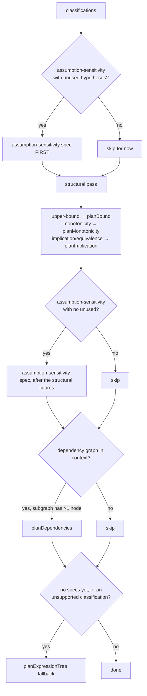

# VisualIR reference

## Renderer independence

VisualIR describes *what to show*, never *how to draw it*. The type file states the rule and the
reason:

```ts
/**
 * VisualIR describes *what to show*, never *how to draw it*.
 *
 * Renderers consume this and nothing else. That separation is what lets the
 * same analysis drive an SVG figure, a Lean infoview widget, and a plain-text
 * diagram without any of them knowing about Lean.
 *
 * Positions are **logical**, not pixels: `layer`/`order` for graphs, and
 * normalised `[0,1]` coordinates for plots. Turning those into geometry is the
 * renderer's job.
 */
```

"Renderers consume this and nothing else" is enforced by the dependency graph, not by
convention. `@prooflens/renderer-svg` and `@prooflens/renderer-text` each depend on exactly two
packages, `@prooflens/epistemics` and `@prooflens/visual-ir`. Neither can see a `TheoremIR`, a
`Classification`, or a `FormalDeclaration`. A renderer that could would be able to draw something
the planner never authorised and never justified.

### Why positions are logical

A pixel is a claim about magnitude. If the planner emitted `x: 240` for a bounded quantity and
`x: 360` for its bound, it would be asserting a ratio that no theorem supports: `simple_upper_bound`
proves `x ≤ P / T` and says nothing at all about how much smaller `x` is. ProofLens does not
evaluate expressions (see [architecture.md](./architecture.md)), so it has no numbers to place
anything with.

Logical positions are the honest encoding of what the planner does know:

- For plot-like figures, `x`/`y` in `[0, 1]` say *which side of the marker* something lies on.
  `planBound` puts the bound at `x: 0.5` and the bounded quantity at `x: 0.32` for an upper bound
  and `x: 0.68` for a lower bound. Those three numbers carry exactly one bit of real content: the
  ordering.
- For graph-like figures, `layer` and `order` say *what comes before what*. `planDependencies`
  sets `layer` to the node's `depth`, which is the length of the longest chain of local
  dependencies below it, computed in `dependencyGraph`. `planAssumptionSensitivity` puts every
  hypothesis on `layer: 0` and the conclusion on `layer: 1`.

The renderers turn these into geometry independently. `renderer-svg` scales `[0, 1]` across a
viewBox and lays layered graphs out in columns; `renderer-text` maps the same `[0, 1]` onto
character cells:

```ts
  const col = (p: number | undefined, fallback = 0.5): number =>
    Math.round(clamp01(p, fallback) * (span - 1));
```

Both are correct because neither is claiming anything the spec did not say. The SVG renderer even
sets `preserveAspectRatio="xMidYMin meet"` so the figure is letterboxed rather than stretched,
with the comment "a distorted figure would misstate relative positions, which on a number line is
a factual error."

## `VisualType`

```ts
export type VisualType =
  | "upper-bound-plot"
  | "lower-bound-plot"
  | "number-line"
  | "monotonicity-plot"
  | "relationship-diagram"
  | "dependency-graph"
  | "implication-graph"
  | "assumption-sensitivity"
  | "expression-tree"
  | "text-diagram";
```

| Type | Shows | Emitted by |
| --- | --- | --- |
| `upper-bound-plot` | A schematic axis with the bound marked, the region the bounded quantity may occupy, and the region the theorem rules out. | `planBound(theorem, c, "upper")` |
| `lower-bound-plot` | The same figure mirrored. | `planBound(theorem, c, "lower")`, which the planner does not currently call — see [roadmap.md](./roadmap.md) |
| `number-line` | A marked value and the regions on either side of it, with no bound semantics attached. | Nothing in v0.1; both renderers handle it |
| `monotonicity-plot` | A schematic curve with its direction of travel, plus the order relation the predicate asserts (`u ≤ v ⟹ f u ≤ f v`). | `planMonotonicity` |
| `relationship-diagram` | A layered graph of elements and how they relate. | Nothing in v0.1; both renderers handle it |
| `dependency-graph` | The declarations this proof term references, layered by dependency depth, plus a count of the edges outside the extraction. | `planDependencies` |
| `implication-graph` | Two propositions and the arrow between them, `→` or `↔`. | `planImplication` |
| `assumption-sensitivity` | Every stated hypothesis as a node, connected to the conclusion when the proof term uses it and detached when it does not. | `planAssumptionSensitivity` |
| `expression-tree` | The conclusion with the hypotheses that lead to it. The structure-preserving fallback. | `planExpressionTree` |
| `text-diagram` | Reserved for a spec whose content is prose. | Nothing in v0.1; falls through to the generic layout in both renderers |

Over the 34 declarations in `examples/corpus.formal-ir.json`, the planner produces 68 figures:
26 `assumption-sensitivity`, 18 `upper-bound-plot`, 11 `dependency-graph`, 6 `monotonicity-plot`,
5 `expression-tree`, and 2 `implication-graph`.

## `VisualEntity`

```ts
export interface VisualEntity {
  id: string;
  kind: EntityKind;
  label: string;
  detail?: string;
  position?: LogicalPosition;
  emphasis?: Emphasis;
  state?: EntityState;
  epistemic: EpistemicStatus;
  sourceRef?: SourceReference;
}
```

| Field | Meaning |
| --- | --- |
| `id` | Unique within the spec. Referenced by `VisualRelationship.from`/`to` and `VisualAnnotation.target`. Renderers derive element ids from it, which is part of what makes SVG output byte-identical across runs. |
| `kind` | One of `quantity`, `bound`, `region`, `function`, `node`, `hypothesis`, `conclusion`, `label`. Renderers switch on this for shape: `pushNumberLine` finds the axis marker with `spec.entities.find((e) => e.kind === "bound")` and fills the axis from the entities with `kind === "region"`. |
| `label` | The primary text. Usually a rendered expression (`renderExpression(bound)`) or a hypothesis symbol. |
| `detail` | Secondary text: a hypothesis statement, a declaration kind, or an annotation's meaning and units. `planBound` fills it from `@prooflens.var` when the bounded quantity is an annotated variable. |
| `position` | `LogicalPosition`: `x`/`y` in `[0,1]` for plots, `layer`/`order` for graphs. Optional, and renderers must survive it being absent or `NaN`. |
| `emphasis` | `primary`, `secondary`, or `muted`. A visual weighting hint, not a claim. |
| `state` | `neutral`, `used`, `unused`, `warning`, `excluded`, `permitted`. This one *is* a claim: `unused` means the proof term does not mention this hypothesis, and `excluded` means the theorem rules this region out. |
| `epistemic` | The standing of this element specifically. Required. |
| `sourceRef` | Where this element came from, including the structural `path` into the expression tree. This is what lets a UI answer "why are you showing me this?" by highlighting the exact subterm. |

The per-element `epistemic` exists because a figure is not epistemically uniform:

```ts
  /**
   * Epistemic standing of *this element*. A bound's position on an axis is
   * usually `illustrative` even when the bound itself is `verified`, because
   * the axis was chosen for legibility.
   */
```

`planMonotonicity` is the clearest case. The function entity carries the classification's status
(`derived`), while the two input markers `u` and `v` are `illustrative`: they exist so the
relationship `u ≤ v ⟹ f u ≤ f v` has endpoints to attach to, and they name no particular values.

## `VisualRelationship`

```ts
export interface VisualRelationship {
  id: string;
  kind: RelationshipKind;
  from: string;
  to: string;
  label?: string;
  emphasis?: Emphasis;
  state?: EntityState;
  epistemic: EpistemicStatus;
  sourceRef?: SourceReference;
}
```

`kind` is one of `bounded-by`, `implies`, `depends-on`, `equals`, `maps-to`, `supports`.

`from` and `to` are entity `id`s, and renderers must tolerate them dangling. The
`renderer-text` test suite asserts this explicitly:

```ts
  it("survives malformed positions and dangling relationship endpoints", () => {
    const spec = graphSpec();
    spec.entities[0]!.position = { layer: Number.NaN, order: Number.NaN };
    spec.relationships.push({
      id: "dangling",
      kind: "implies",
      from: "nope",
      to: "also-nope",
      epistemic: "derived",
    });
    expect(() => renderText(spec)).not.toThrow();
  });
```

`state` on a relationship carries the same meaning as on an entity. In
`planAssumptionSensitivity`, a `supports` edge is emitted only for hypotheses the proof term
uses, and it is marked `state: "used"`. Unused hypotheses get an entity and no edge, which is
what "drawn detached" means concretely.

## `AxisSpec`

```ts
export interface AxisSpec {
  id: string;
  orientation: "horizontal" | "vertical";
  label: string;
  units?: string;
  scale: "numeric" | "schematic";
  ticks: Array<{ at: number; label: string; emphasis?: Emphasis }>;
  epistemic: EpistemicStatus;
}
```

| Field | Meaning |
| --- | --- |
| `id` | Identifier within the spec. `planBound` uses `"value"`; `planMonotonicity` uses `"input"` and `"output"`. |
| `orientation` | Which way the axis runs. |
| `label` | Axis label. `planBound` prefers the annotated `meaning` over the raw expression, so an annotated theorem gets "achieved operation rate" rather than "x". |
| `units` | From `@prooflens.var … units="…"`, when present. |
| `scale` | `numeric` or `schematic`. See below. |
| `ticks` | Positions in the same `[0,1]` logical space as `LogicalPosition.x`. `planBound` emits exactly one, at `0.5`, labelled with the bound expression. |
| `epistemic` | Required. Every axis v0.1 emits is `illustrative`. |

`scale` is the field that keeps a plot from becoming a lie:

```ts
  /**
   * Whether the axis carries real numbers or is purely schematic. Schematic
   * axes are `illustrative`: positions along them mean "this side of that",
   * nothing more.
   */
```

Renderers act on it. `pushNumberLine` computes `const schematic = axis === undefined || axis.scale === "schematic";` and prints the qualifier in the axis caption and in the key. Every axis
ProofLens plans today is schematic, because nothing evaluates expressions. `numeric` exists so
that a future stage which does evaluate has a way to say so without changing the schema.

## `VisualAnnotation`

```ts
export interface VisualAnnotation {
  id: string;
  kind: AnnotationKind;
  text: string;
  target?: string;
  epistemic: EpistemicStatus;
}
```

`kind` is one of `caption`, `callout`, `warning`, `legend`, `rationale`.

| Kind | Used for |
| --- | --- |
| `rationale` | The sentence that justifies the figure. Every planner function emits exactly one, with `id: "rationale"`, mirroring `VisualSpec.rationale`. |
| `callout` | A specific derived fact about one element, with `target` naming it. `planBound` emits one per sensitivity direction: "Increasing T decreases the bound." |
| `legend` | The epistemic notice and the caveats. `epistemicNotice` produces the schematic-axis legend; `planAssumptionSensitivity` produces the "a different proof might need them" caveat; `planDependencies` produces the external-dependency count. |
| `warning` | `planBound` emits one when `theorem.trust.usesSorry`: "This statement is not proved: its proof reaches `sorryAx`." |
| `caption` | Reserved; nothing in v0.1 emits one. |

## The epistemic encoding rule

Two rules govern every spec the planner emits, stated in the planner's own header:

```ts
/**
 * The visualization planner.
 *
 * MathIR plus classifications go in; VisualIR comes out. Two rules govern
 * everything here:
 *
 *  - Every spec must carry a `rationale` naming the evidence that selected it.
 *  - Anything chosen for legibility rather than mathematics is `illustrative`.
 *    A schematic axis makes no claim about magnitudes, and saying so is not
 *    pedantry: it is the difference between a diagram and a lie.
 */
```

### A schematic axis is `illustrative`

`planBound` emits its axis like this:

```ts
      {
        id: "value",
        orientation: "horizontal",
        label: boundedAnnotation?.meaning ?? boundedLabel,
        units: boundedAnnotation?.units,
        scale: "schematic",
        ticks: [{ at: 0.5, label: boundLabel, emphasis: "primary" }],
        // Nothing here is measured. Saying otherwise would be a fabrication.
        epistemic: "illustrative",
      },
```

The distinction to hold on to: the *regions* in that figure are `derived`, because "x may lie
below P / T" is a genuine consequence of the theorem. Only their *drawn extent* is a display
choice, and that is what the axis's `illustrative` status covers. The planner comments the
difference where it makes it:

```ts
        // The region is a real consequence of the theorem; only its drawn
        // extent is a display choice.
        epistemic: status,
```

### A spec's overall status is the weakest of anything in it

```ts
    epistemic: weakest(status, "illustrative"),
```

`weakest` from `@prooflens/epistemics` is the only combinator ProofLens uses to propagate
epistemic state, and it is why confidence cannot be laundered upward. A bound figure whose
classification is `derived` and whose axis is `illustrative` is an `illustrative` figure. This is
why the corpus histogram reads:

```
  figures by epistemic status:
    derived         44  Computed from the verified statement by a deterministic rule.
    illustrative    24  A display choice. It makes no mathematical claim.
```

The 24 `illustrative` figures are the 18 bound plots and the 6 monotonicity plots, which are
exactly the two kinds with a schematic axis. `assumption-sensitivity` figures are `derived`
throughout and say so, because nothing in them is schematic: every node's `state` is a mechanical
fact about the elaborated term.

The renderers repeat this at the output boundary rather than trusting it to be understood.
`renderer-svg` writes the whole-figure status into `data-prooflens-epistemic`, into the `<desc>`
text, and into a legend row, and draws anything weaker than `derived` with a broken stroke.
`renderer-text` prints it in the header:

```
════════════════════════════════════════════════════════════════════════
x ≤ P / T
power-limited rate bound  •  upper-bound-plot
════════════════════════════════════════════════════════════════════════
status: illustrative — A display choice. It makes no mathematical claim.
```

## `rationale` is mandatory

```ts
  /**
   * Why this visualization was chosen, in one sentence, naming the evidence.
   * Required. A figure that cannot explain itself does not ship.
   */
  rationale: string;
```

It is a required field on `VisualSpec`, so a spec without one does not typecheck. Both renderers
print it under a "WHY THIS FIGURE" heading.

The point is that the rationale names *evidence*, not the rule's general description. Compare
what the `Rule` says with what the rationale says for the same firing on `simple_upper_bound`:

```
rule.description: The conclusion bounds a quantity from above.
rationale:        The conclusion `x ≤ P / T` puts `x` on the smaller side of `≤`,
                  so `P / T` is an upper bound for it.
```

The first is true of thousands of theorems. The second can be checked against this one. For
`information_rate_bound`, whose flagship figure is the assumption-sensitivity view, the rationale
is generated from the actual occurrence analysis:

```
`hP` does not occur in the elaborated proof term, in any later hypothesis type,
or in the conclusion.
```

Two planner functions do not take their rationale from a classification, because no
classification selected them, and both say so explicitly:

- `planDependencies`: "A dependency graph is always available, because it is read directly from
  the proof term rather than from any recognised statement shape."
- `planExpressionTree`: the unsupported classification's `reason` when there is one, and
  otherwise "Shown so the statement's structure stays inspectable."

## The planner's selection order

`planVisuals(theorem, classifications, context)` returns specs most-informative-first, and always
returns at least one.



### 1. Assumption sensitivity first, but only when there are unused hypotheses

```ts
  // A theorem with a redundant hypothesis is more interesting than its plot.
  if (sensitivity && hasUnused) {
    const spec = planAssumptionSensitivity(theorem, sensitivity);
    if (spec) specs.push(spec);
  }
```

This is the one place the planner ranks one figure above another on editorial grounds, and the
reason is that a stated-but-unused hypothesis is a fact about the proof that the reader cannot
get any other way, whereas the bound plot restates something already visible in the statement.
Two of the 34 corpus declarations take this branch: `simple_upper_bound`, where `hP` and `hT` are
decorative, and `information_rate_bound`, where `hP : 0 < P` is stated because a machine drawing
nonpositive power is not a machine, and the derivation never touches it.

Note the gate in `classifyAssumptionSensitivity`: if no binder reports `proofTermAvailable`, the
classification is not produced at all, so an axiom or an opaque declaration gets no
assumption-sensitivity figure rather than a figure claiming everything is unused.

### 2. Structural figures, in classification order

The loop walks `classifications` in the order `classifyTheorem` produced them and dispatches on
`payload.kind`. Only `upper-bound`, `monotonicity`, `implication` and `equivalence` have a
branch; `lower-bound`, `equality`, `functional-relationship`, `definition` and `unsupported` fall
through.

### 3. Assumption sensitivity, if it was not already emitted

```ts
  if (sensitivity && !hasUnused) {
```

A theorem where every hypothesis is used still gets the figure, just after its structural one.
The rationale in that case reads "Every one of the N stated hypotheses occurs in the elaborated
proof term."

### 4. Dependency graph

Emitted whenever `context.dependencies` is supplied and `subgraphFor(graph, theorem.id)` has more
than one node. `runPipeline` always supplies it. Eleven of the 34 corpus declarations have a
local dependency deep enough to draw.

### 5. The structure-preserving fallback

```ts
  const unsupported = classifications.find((c) => c.payload.kind === "unsupported");
  if (specs.length === 0 || unsupported) {
    specs.push(planExpressionTree(theorem, unsupported));
  }
```

Note the `||`: the fallback is appended whenever there is an `unsupported` classification, even
if other specs were planned. `switching_coefficient_ne_zero` gets
`assumption-sensitivity, dependency-graph, expression-tree` for this reason.

The function's docstring states the invariant this exists to satisfy:

```ts
/**
 * Plan every visualization for a theorem, most informative first.
 *
 * Always returns at least one spec. Unsupported mathematics still gets its
 * structure drawn, because throwing the theorem away is the one outcome
 * ProofLens is not allowed to have.
 */
```

## How to add a renderer

A renderer is a package that depends on `@prooflens/visual-ir` and `@prooflens/epistemics` and
nothing else, and exports a function from `VisualSpec` (plus renderer-specific options) to its
output type. Use `packages/renderer-text` as the smaller model.

### The contract

1. **Handle every `VisualType`, including ones you do not know.** A `VisualType` you have never
   heard of must render as *something*, not throw. Both existing renderers do this with a
   `default` branch to a generic layout:

   ```ts
   function dispatch(type: VisualType | string, spec: VisualSpec, ctx: RenderContext): LayoutResult {
     switch (type) {
       …
       default:
         return layoutGeneric(spec, ctx);
     }
   }
   ```

   Note the parameter type is `VisualType | string`, deliberately: a spec produced by a newer
   planner than your renderer must still render. `renderer-svg` goes further and wraps dispatch in
   `safeLayout`, which catches a throwing layout, retries with the generic one, and returns an
   empty block if even that fails. The comment gives the reason: "dropping a theorem on the floor
   is the one outcome ProofLens is not allowed to have."

   The test both renderers ship enumerates every declared type and asserts none throws.

2. **State the epistemic status in the output itself.** Not in a tooltip a reader might not open,
   and not only through colour. `renderer-svg` uses a `data-` attribute, the `<desc>` text, a
   legend row, and a broken stroke; `renderer-text` prints
   `status: <status> — <EPISTEMIC_GLOSS[status]>` in the header. Use `EPISTEMIC_GLOSS` from
   `@prooflens/epistemics` verbatim so every surface says the same thing.

3. **Print the `rationale`.** It is required on the spec for a reason.

4. **Do not drop `state: "unused"`.** A hypothesis the proof never touches must be visibly
   different from one it uses, and the difference must survive the output being pasted somewhere
   with no colour.

5. **Be deterministic.** No clock, no random source, no ambient state. Derive element ids from the
   spec's own ids. `renderer-svg` states this first among its four load-bearing properties, and
   the reason is that ProofLens figures are meant to be committed and diffed.

6. **Survive malformed input.** Missing `position`, `NaN` coordinates, dangling relationship
   endpoints, zero entities. Both renderers have tests for each; `renderText` on an empty spec
   emits "no elements to show".

### Wiring it up

Add the package to `pnpm-workspace.yaml` (already covered by `packages/*`), add it to the `build`
and `typecheck` script lists in the root `package.json`, and add a dependency from
`@prooflens/cli` if it should be reachable from `prooflens render`. Nothing else in the pipeline
needs to change: the planner does not know how many renderers exist.

## Related documents

- [architecture.md](./architecture.md) — the stage pipeline and the renderer boundary
- [math-ir.md](./math-ir.md) — what the planner consumes
- [epistemic-model.md](./epistemic-model.md) — `weakest`, `EPISTEMIC_GLOSS`, and the lattice
- [adr/0002-first-rendering-surface.md](./adr/0002-first-rendering-surface.md) — why the infoview widget was the first renderer target
- [roadmap.md](./roadmap.md) — the visual types that exist but are not yet planned
